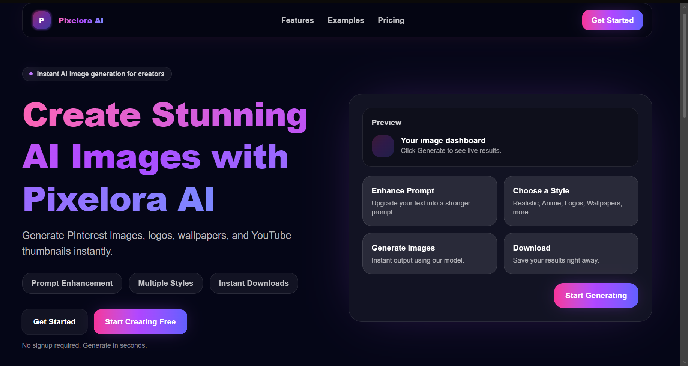
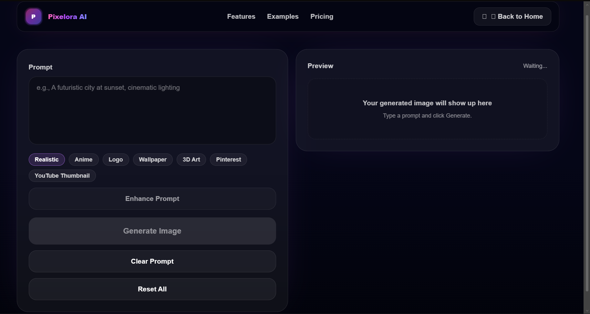
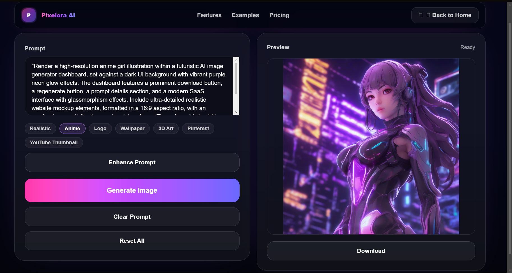

<div align="center">


# Pixelora AI

AI-powered image generation platform built with **Next.js**, **React**, **TypeScript**, **Tailwind CSS**, **Cloudflare AI**, and **Groq AI**.

Generate stunning AI images from simple prompts with prompt enhancement, multiple style presets, and instant downloads.

<p>
<a href="https://nextjs.org">

</a>

<a href="https://react.dev">

</a>

<a href="https://www.typescriptlang.org">

</a>

<a href="https://tailwindcss.com">

</a>

<a href="https://developers.cloudflare.com/ai/">

</a>

<a href="https://vercel.com">

</a>

</p>

</div>

---

# 📸 Screenshots

| Landing Page | Generate Page |
|--------------|---------------|
|  |  |

| Result Page |
|-------------|
|  |

---

# ✨ Features

- 🎨 AI Image Generation
- ✨ Prompt Enhancement using Groq AI
- 🎭 Multiple Style Presets
- 🖼️ Real-time Image Preview
- 📥 One-click Image Download
- ⚡ Fast Cloudflare AI Backend
- 📱 Responsive Modern UI
- 🌙 Beautiful Dark Theme
- 🚀 Vercel Deployment Ready

---

# 🛠 Tech Stack

| Category | Technology |
|----------|------------|
| Frontend | Next.js |
| UI | React |
| Language | TypeScript |
| Styling | Tailwind CSS |
| AI | Cloudflare AI |
| Prompt Enhancement | Groq AI |
| Deployment | Vercel |

---

# 🚀 Installation

### Clone Repository

```bash
git clone https://github.com/YOUR_USERNAME/YOUR_REPOSITORY.git
```

### Open Project

```bash
cd ai-image-site
```

### Install Packages

```bash
npm install
```

### Create Environment File

Create

```
.env.local
```

and add:

```env
GROQ_API_KEY=your_key

CLOUDFLARE_WORKER_URL=your_worker_url

CLOUDFLARE_API_KEY=your_cloudflare_key

HUGGINGFACE_API_KEY=your_huggingface_key
```

### Run Project

```bash
npm run dev
```

Open

```
http://localhost:3000
```

---

# ⚙ Environment Variables

| Variable | Description |
|-----------|-------------|
| GROQ_API_KEY | Prompt enhancement |
| CLOUDFLARE_WORKER_URL | Cloudflare Worker Endpoint |
| CLOUDFLARE_API_KEY | Worker Authorization |
| HUGGINGFACE_API_KEY | Fallback Image API |

---

# 🚀 Usage

1. Open the application.
2. Enter your image prompt.
3. Select a generation style.
4. Enhance the prompt (optional).
5. Click **Generate Image**.
6. Wait for the AI response.
7. Preview the generated image.
8. Download the final result.

---

# 🔌 API Architecture

```
User
   │
   ▼
Next.js Frontend
   │
   ▼
API Routes
   │
   ├────────► Groq AI
   │           │
   │           ▼
   │    Prompt Enhancement
   │
   ▼
Cloudflare Worker
   │
   ▼
AI Image Generation
   │
   ▼
Generated Image
```

---

# 📂 Project Structure

```
ai-image-site
│
├── app
│   ├── api
│   ├── generate
│   ├── page.tsx
│
├── public
│
├── assets
│   ├── banner.png
│   ├── landing-page.png
│   ├── generate-page.png
│   └── result-page.png
│
├── README.md
├── package.json
└── tsconfig.json
```

---

# ☁ Deployment

Deploy on **Vercel**

```bash
npm run build
```

Push your repository to GitHub.

Import the repository into Vercel.

Add all required Environment Variables.

Deploy.

---

# 🚀 Future Roadmap

- [ ] Image History
- [ ] User Authentication
- [ ] Favorites Collection
- [ ] AI Image Editing
- [ ] AI Upscaling
- [ ] More AI Models
- [ ] Video Generation
- [ ] Mobile Optimization
- [ ] Dark/Light Theme Toggle

---

# 🤝 Contributing

Contributions are welcome.

1. Fork the repository.

2. Create a new branch.

```bash
git checkout -b feature-name
```

3. Commit your changes.

```bash
git commit -m "Added new feature"
```

4. Push the branch.

```bash
git push origin feature-name
```

5. Open a Pull Request.

---

# 📄 License

This project is licensed under the **MIT License**.

---

# 👨‍💻 Author

**Simple Boy**

GitHub

https://github.com/arsaini809456-collab

LinkedIn

(Add your LinkedIn Profile)

Portfolio

(Add your Portfolio Website)

---

# ❤️ Acknowledgements

Special thanks to

- Next.js
- React
- TypeScript
- Tailwind CSS
- Cloudflare AI
- Groq AI
- Hugging Face
- Vercel

---

<div align="center">

### ⭐ If you like this project, don't forget to Star the repository!

Made with ❤️ using Next.js & Cloudflare AI

</div>